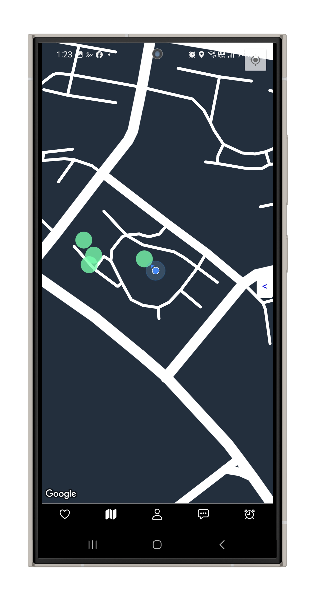
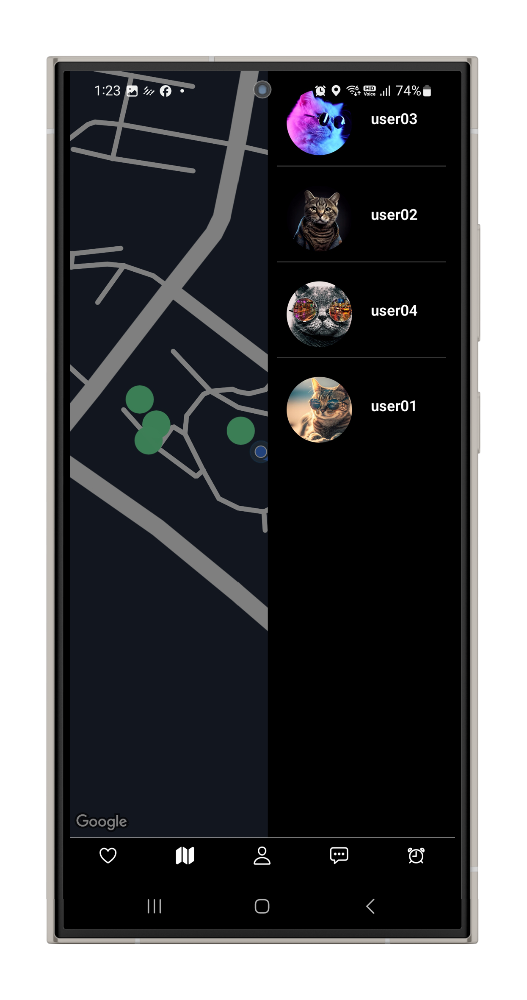
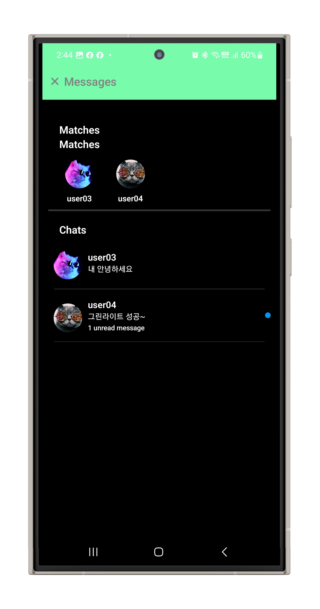
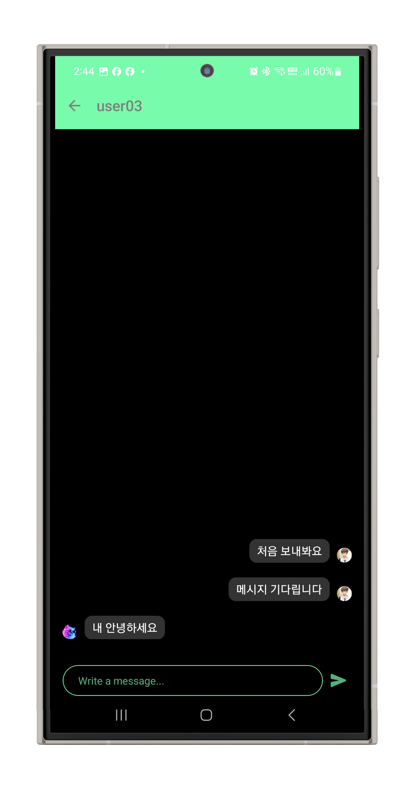
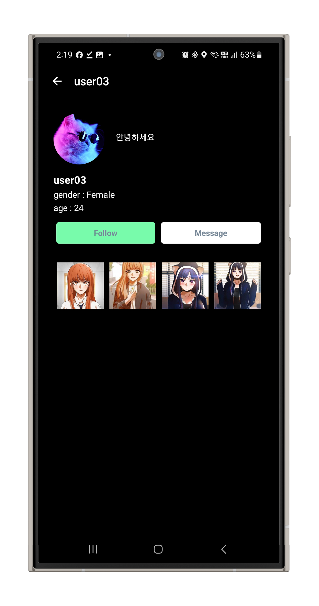
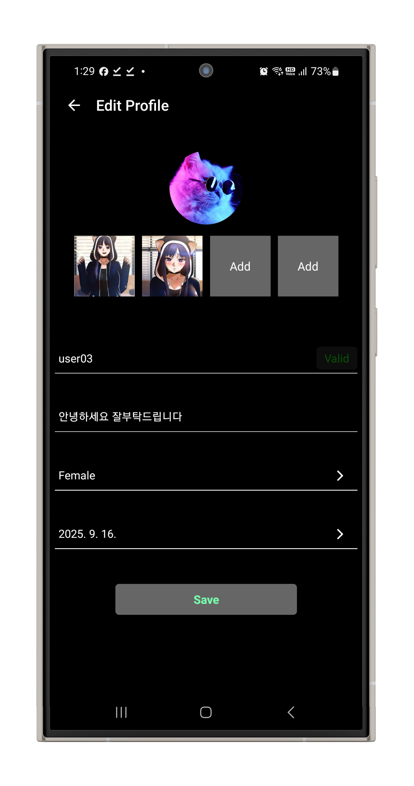
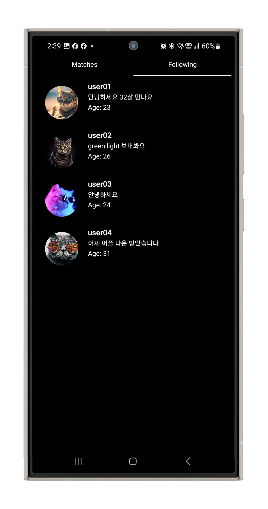
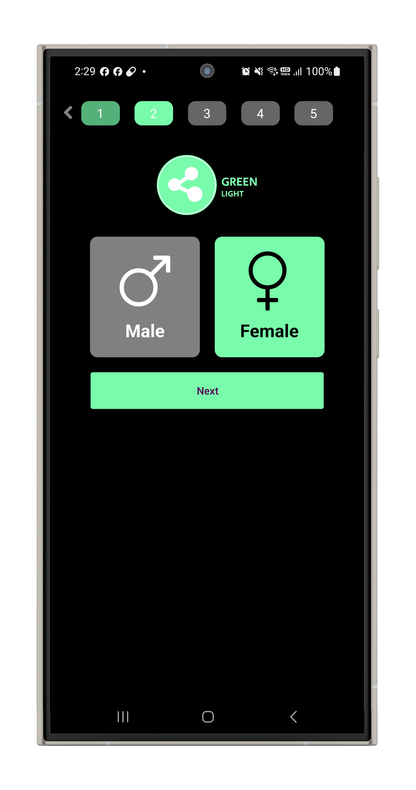

# 🌟 GreenLight – 새로운 오프라인 만남의 방식

> **"거절의 두려움 없이, 안전하게. 온라인보다 현실에서 먼저 연결되는 진짜 만남."**

GreenLight는 기존의 건전하지 못하고 위험할 수 있는 온라인 만남 방식을 넘어,  
오프라인의 우연성과 온라인의 편리함을 결합한 새로운 형태의 만남 플랫폼입니다.  

우연히 스쳐 지나가는 현실의 순간을 놓치지 않고,  
육안으로 확인 가능한 50m 반경 내의 사람들에게만 안전하게 그린라이트를 보낼 수 있습니다.  

더 이상 누가 나타날지 모르는 불확실한 온라인 만남이 아닙니다.  
현실 속에서 실제로 마주치는 인연을 기반으로,  
자연스럽게 이어지는 진짜 만남을 추구합니다.  
---

## 🚀 주요 기능

### 🔍 실시간 위치 기반 매칭
- 구글 맵과 연동된 실시간 위치 공유
- **50m 반경** 이내에 있는 사용자만 표시 → 실제로 눈에 보이는 거리
- 지도에서 상대방 프로필을 직관적으로 확인 가능

  
  

---

### 💚 그린라이트 (Green Light) 시스템
- 마음에 드는 사람에게 **그린라이트**를 보낼 수 있음
- 상대방은 내가 보낸 사실을 절대 알 수 없음
- 오직 **서로 동시에 보냈을 때만** → "그린라이트 성사!" 알림이 뜸
- ✔️ 거절의 불편함 없음  
- ✔️ 성공 시, 바로 채팅 가능

  
  

---

### 👤 프로필 관리
- 사진, 소개글, 나이, 성별 설정 가능
- 깔끔한 UI로 자기 표현이 용이
- 신뢰성 있는 프로필 기반 → 건전하고 진지한 매칭

  
  

---

### 🤝 매칭 & 팔로우
- "Matches" 탭에서 내가 매칭된 사람들을 한눈에 확인
- "Following" 기능을 통해 마음에 드는 사람을 계속 주시 가능
- 매칭 이후엔 자연스럽게 대화로 이어질 수 있음

  

### 👤 회원가입
- "Matches" 간단한 회원가입
- 다섯가지 절차를 완료하고 조건 동의 후 가입

  

---

## 🌈 GreenLight의 장점

1. **거절 없는 매칭**
   - 상대방이 나를 거절했다는 불편한 경험이 없음
   - 오직 상호 관심이 있을 때만 연결됨

2. **오프라인 중심**
   - 수많은 가짜 온라인 매칭이 아닌, 실제로 **눈앞에 있는 사람**과 연결
   - "스쳐 지나간 인연"을 놓치지 않게 함

3. **안전한 거리 제한**
   - 50m 반경 내로 제한하여 불필요한 노출 방지
   - 실제로 근처에 있는 사람만 표시 → 안전 + 현실적

4. **즉각적인 대화**
   - 매칭되면 즉시 채팅 가능
   - 오프라인의 설렘과 온라인의 편리함을 동시에 제공

---

## 🛠️ 기술 스택

### Frontend
- **React Native (TypeScript)** : iOS & Android 동시 개발
- **Apollo Client** : GraphQL 기반 데이터 관리
- **Realtime UI** : Pub/Sub 기반 알림 시스템

### Backend
- **Node.js + Apollo Server** : GraphQL API 서버
- **Prisma ORM** : 타입 안전한 DB 액세스
- **Firebase Authentication** : 소셜 로그인 및 인증
- **Firebase Cloud Messaging** : 실시간 푸시 알림
- **Google Pub/Sub** : 이벤트 기반 실시간 매칭 처리
- **AWS (EC2, S3, RDS, Lambda)** : 확장 가능한 인프라

### Database
- **PostgreSQL (Prisma로 관리)**
- **Redis** : 세션 관리 및 매칭 큐 처리

---

## 📸 전체 앱 스크린샷

  
  
  
  
  
  
  

---

GreenLight는  
- 온라인 만남의 **위험성과 가짜 연결**을 줄이고,  
- 오프라인의 **진짜 설렘과 자연스러운 연결**을 살린  
**새로운 만남 패러다임**을 제시합니다.  

---
**Apollo + AWS + Firebase + Prisma** 기반으로 실제 구현

> ⚠️ 백엔드는 [green-light-backend](https://github.com/hmchung2/green-light-backend) 레포를 참조하세요.
> .env 세팅은 비공개
